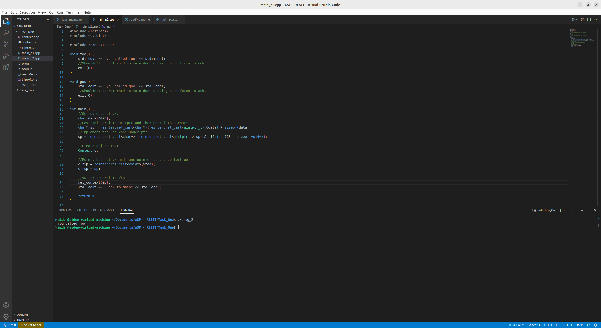

# Task One

## Part One

The first part of this task was to implement a simple main function that used set and get context to achieve a desired
output, to do this I first included context.hpp, an API provided by the university which uses the context file also provided,
which allowed for use of the required functions, I then set the x variable, created and obj of context, then used this obj
within the get_context function, the if loop then runs once incrementing the value of x by 1 and then calling set_context using c,
this then causes the if loop to not run the second time as the new value of x is 1.

To compile and run this part of the code use clang++ main_p1.cpp context.o -o prog and then run it with ./prog

## Part Two

The second part of task 1 was to make it so that control could be switched to another function that is acting as a fiber,
to begin with I again included the context.hpp and then created the foo function that would act as a fiber, all this function does
is print that its been called to show the program is running. I then began the main function, here I started by setting up the data stack
and the creating the ptr for it, to do this the program converts the memory address of the data variable and converts it
into a unitptr and then adds the current size of the data variable to it, then it casts this back into a char* using
reinterpret_cast allowing for it to be used as a ptr, line 22 of program. Then it takes the sp ptr and then uses -16L
to turn the data into 16-byte, after this it subtracts 128bytes and the sizeof(void*) to add the Red Zone.

Then the program assigns c.rip to a void* ptr using the memory address of foo, c.rsp is then set to the sp made
earlier in the function, c is an obj of context. Then it calls set_context using the memory address of c to show that control has been switched
to foo.

To compile and run this part of the code use clang++ main_p2.cpp context.o -o prog and then run it with ./prog