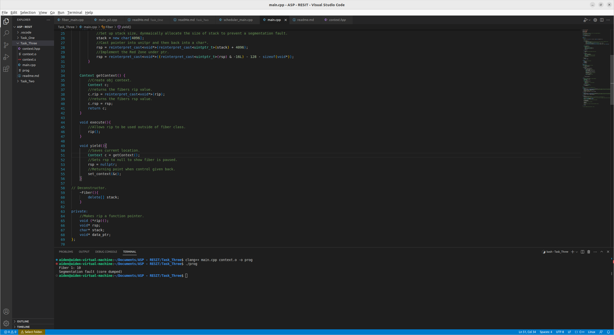

# Task Three

## Yield Function

For the final task we have to implement a yield function that stops a fiber that is currently running and then allows it to continue from the same point later on in the schedulers run time.
To do this I first implemented the yield function within the fiber class, as shown in the following code it first creates a Context obj and sets it to the current value of the fiber thats running
then it sets the rsp to show null, this shows the program that the fiber has paused, then it sets the context to the mem address of c so that when control is returned to that fiber
it knows where it has to start from.
``` json

    void yield(){
        //Saves current location.
        Context c = getContext();
        //Sets rsp to null to show fiber is paused.
        rsp = nullptr;
        //Returning point when control given back.
        set_context(&c);
    }
```

The next change I made to the code was to fiber1 and fiber2, the first change happend to both which was to add an instance of fiber, this instance is set to the current context of the shared
ptr, get_data(), fiber1 then has the yield() function called within it to show that it works.
The final change was to the main function, here I had to change one of the parameters of the fiber objs created, this is due to the previous changed to the fiber functions themselves making it so
they already have the value of get_data() when created here. This should output the desired result of fiber 1, fiber 2, fiber 1 before exiting.

The following image shows this code running:


Like with the previous task it gives a segmentaion fault.

To compile this code use clang++ main.cpp context.o -o prog and to run use ./prog
