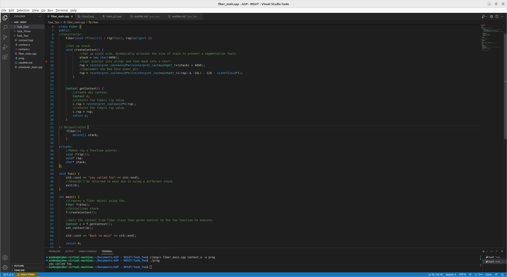
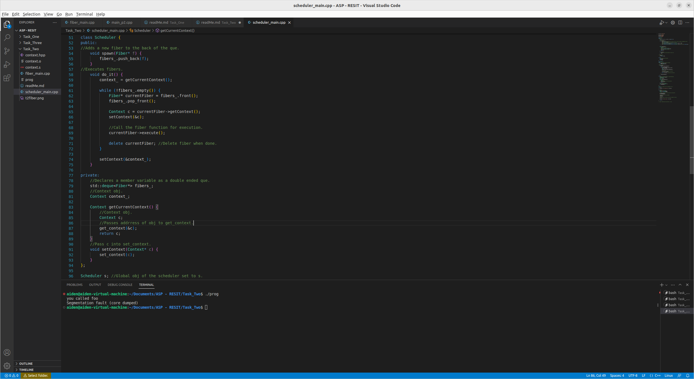

# Task Two

## Part One - Fiber

The first step for setting up the fiber was to create the class fiber and set the public and private memebers, for this
the private members are the relevant ptrs used within the fiber class. The public members are the constructor, which takes a
function ptr and sets it to an instruction ptr, using rip, for the fiber. Then I created a method that sets up the stack for the 
fiber, I used the same method used for the foo function in task one, the getContext() method retrieves the nessacary context
for the ptrs by creating an obj of Context and assigning the values to them.

Within the main function I create and obj of the Fiber class, this uses foo as its entry function, then call the creatContext() method with the f
obj to initialise the fiber stack, then assigns the context of the fiber to the Context obj c and then finally switchs controll to the fiber
using setContext.

## Part Two - Scheduler

To implement the scheduler class I first made a small modification to the exsisting fiber class, this was to create an execute method that had the rip
function within it, this was to allow it to be used within the scheduler class.

Then I begin creating the scheduler class, the private members of this class are fibers_, that holds the ptr values to the fibers, and context_, which is an
obj of the original context provided to the scheduler class. For the public members I first made the spawn(Fiber* f) method, this method creates a new fiber and
then pushes it to the back of the schedulers que. Then I created the do_it() method, this is what actually executes the fibers, to execute the fibers it retrieves
the current context from context_ and then switches it with the context of the next fiber to be executed, it then executes it using the rip() frome the 
execute method in the Fiber class and finally deletes the fiber after it has been executed.

After this I defined foo() as a simple function then made Scheduler a gobal variable, by making the Scheduler variable global it makes it accessible
to all functions within the code, it removes the need to pass it into other functions making it more accessible, making it global also means that the one
instance of the scheduler can run/manage all fibers we aim to run within the program after being called once, this reduces the amount of objs needed to be 
created of it within the code.

The main function for this part of the task first creates two seperate obj's of foo() and then initialise their own individual stacks using createContext(), they
are then added to the sceduler class, then when do_it() is called both of the fibers should be executed on after another before the program finishes.

Currently when the program runs it executes the first fiber correctly however when running the second fiber it returns a segmentaion fault, this is likely due to 
the program not switching control correctly.

